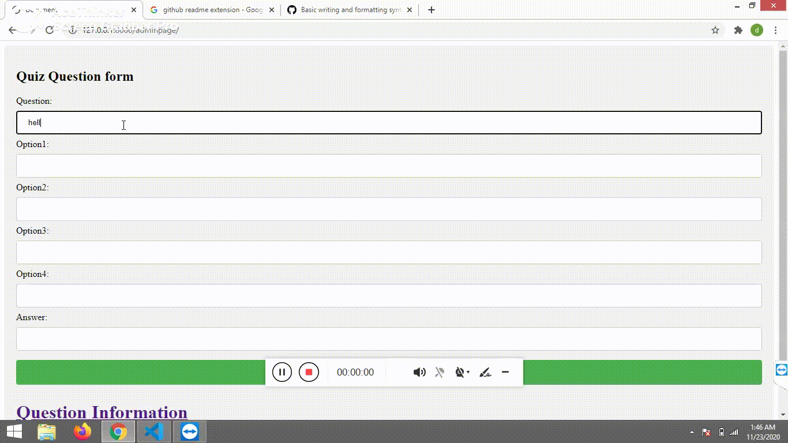

# Quiz_Time

## Implemented Quiz_Time web application using Python Django framework in order to learn about CRUD operations.

###### Admin can create simple quiz and update, delete that quiz data. User can play Quiz and get a score at the end.

## Example 

